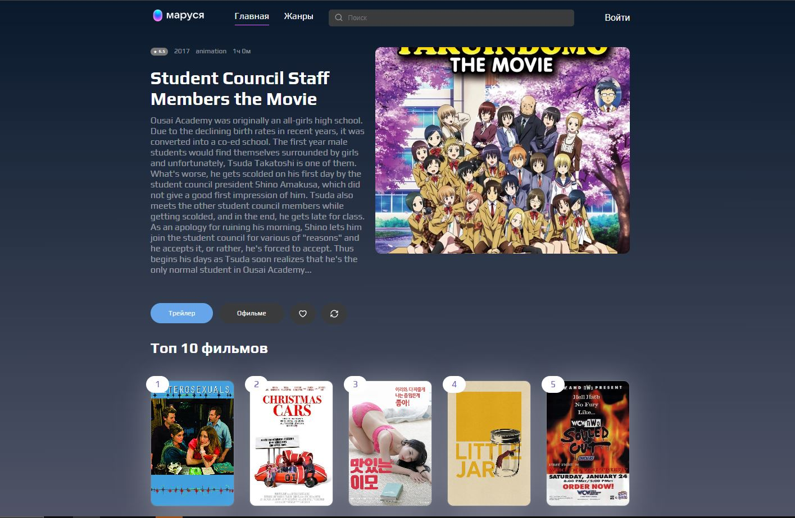

# MovieApp - Кино-гид с персональными рекомендациями

Веб-приложение для поиска фильмов, управления избранным и получения персонализированных рекомендаций. Пользователи могут регистрироваться, добавлять фильмы в избранное и просматривать детальную информацию о кинокартинах.



## 🛠 Технологии

- **React** (функциональные компоненты, хуки)
- **typeScript** (статическая типизация)
- **React Router v6** (навигация между страницами)
- **Redux Toolkit** (управление состоянием приложения)
- **React Query** (кэширование и управление сетверным состоянием)
- **Zod** (валидация схем данных)
- **CSS Modules** (изолированные стили компонентов)

## Ключевые особенности

- **Функциональность**:
  - Поиск фильмомв
  - Детальная информация о фильме
  - Навигация по жанрам
  - Топ 10 лучших фильмов
  - Избранные фильмы
  - Управление данными в профиле пользователя

- **Интерактивный интерфейс**:
  - Адаптивный дизайн
  - Лениая загрузка
  - Интуитивная навигация
  - Мгновенное добавление/удаление в профиле

## Запуск проекта

1. Клонируйте репозиторий:
```bash
git clone https://github.com/Oxana48/react-project
```

2. Установите зависимости:
```bash
git install
```

3. Запустите проект:
```bash
npm run dev
```

Приложение будет доступно по адресу http://localhost:5173